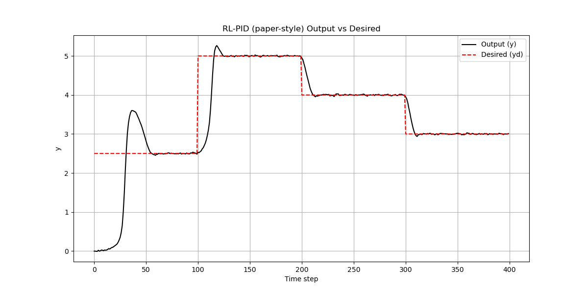
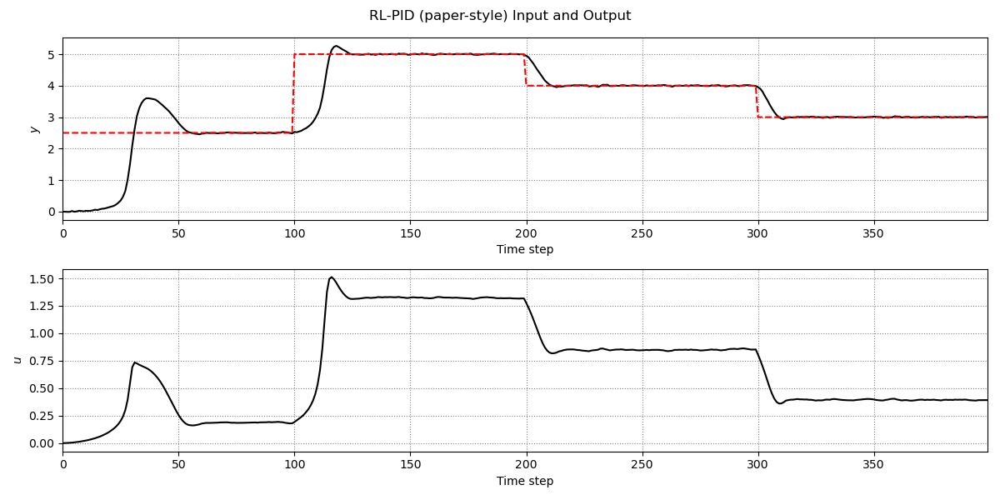
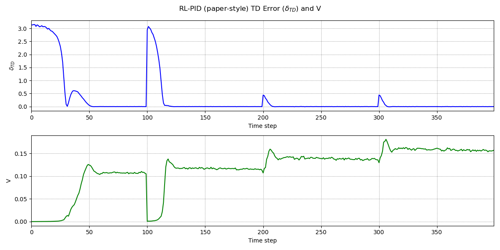
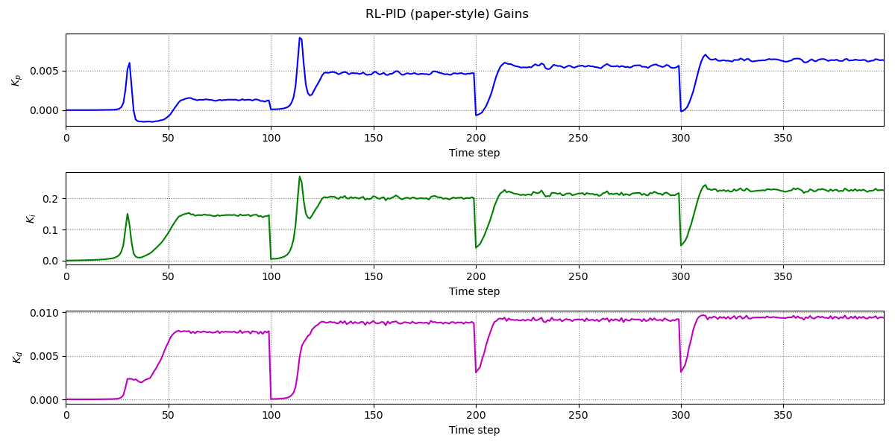
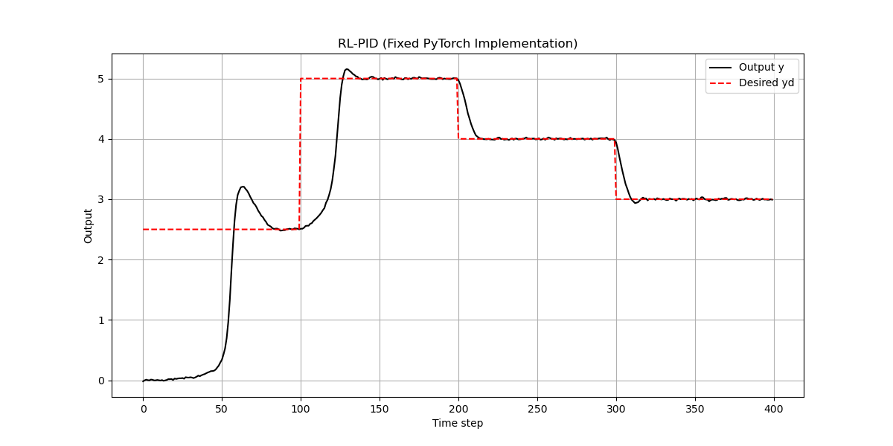
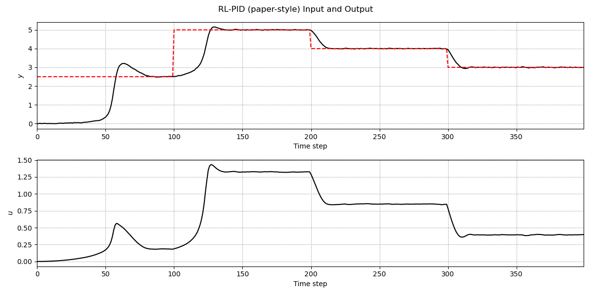
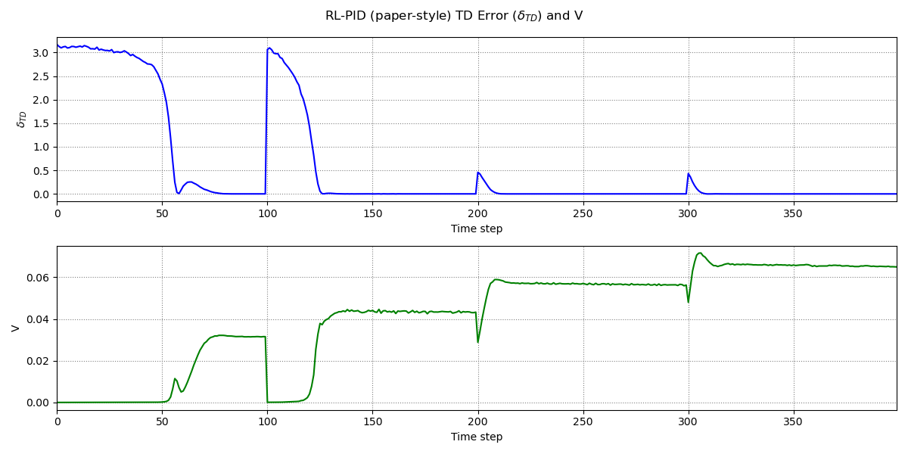
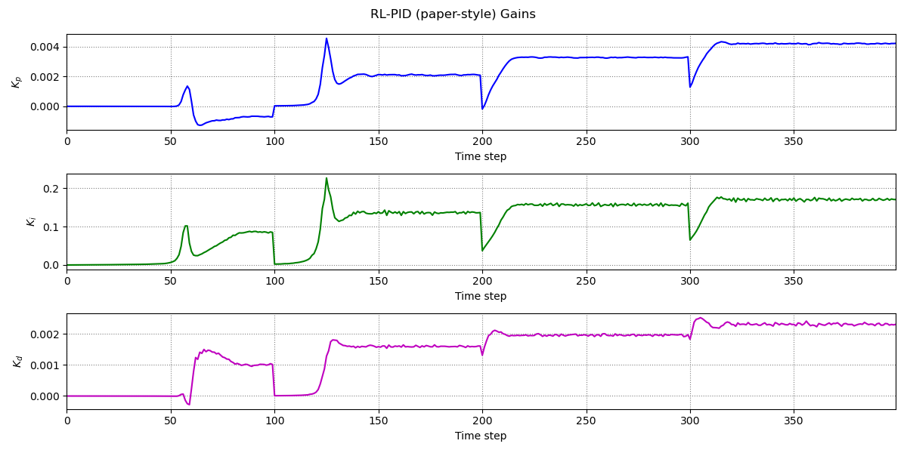

# Reinforcement Learning Proportional Integral Derivative Controller

This repository contains:
- Two setups (python code with pure Numpy Implementation, python code with Pytorch Implementation)
- Obtained control, weights, TD error and Value Function showcased
- Simulated implementation exemplified

for the following paper by Guan and Yamamoto.
```bibtex
@article{Guan2020DesignOA,
  title={Design of a Reinforcement Learning PID controller},
  author={Zhe Guan and Toru Yamamoto},
  journal={2020 International Joint Conference on Neural Networks (IJCNN)},
  year={2020},
  pages={1-6},
  url={https://api.semanticscholar.org/CorpusID:221666056}
}
```

## Adaptive Neural PID Controller
- Run Code: For pure numpy implementation, use the file `rl_pid_setup1.py' and run.
- Run Code: For pytorch implementation, use 'rl_pid_setup2.py' and run.
- Visualize the results below

### Numpy Implementation
 

 


### Pytorch Implementation
 

 

